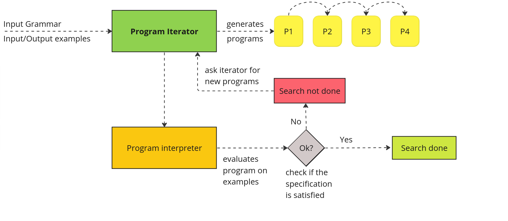
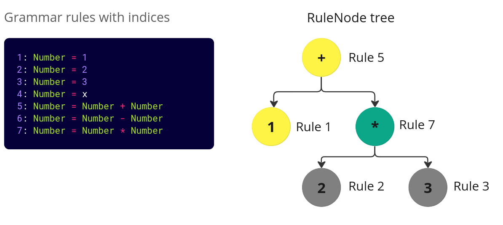

# Herb Architecture and Core Concepts

## Architecture Introduction
Herb is a _program synthesis_ framework that gives users a great amount of flexibility. 

At its core, program synthesis is trying to search over a _space_ of programs in the attempt to find a program that satisfies a given specification. The specification is most often done as pairs of input/output examples. 

Here is a nice picture showing the synthesis process.


As you can see from the picture above, there are a few parts that needed in the synthesis process. Namely:
1. Grammar
2. Interpreter
3. Iterator
4. Examples

Each part will be discussed in detail how it is implemented in Herb, and small code examples will be provided. After reading through this tutorial you should have a basic general understanding of how _Herb_ works and have an overview of important Herb modules (e.g., `HerbSearch`, `HerbCore`, `HerbSpecification`, `HerbBenchmarks`, `HerbCore`, etc.)

### 1. HerbGrammar
First of, let's start with how do we define grammars in Herb. Grammars provide a set of rules that are used when creating programs. One could have an arithmetic expression grammar that allows addition, subtraction, multiplication, etc. Another example could be a grammar that allows bit manipulation operations (e.g., *shift left*, *shift right*, etc.), string operations (e.g., `concat`, `replace`, `findindex`, etc.).

Ideally, it should be possible to define _any_ grammar in Herb.

One possible approach could be to let users write the grammar definition in a file `mygrammar` in a grammar format (e.g., BNF). For instance, for arithmetic expressions, a user would create a grammar as shown below. 
```
<expr> ::= <term> "+" <expr>
        |  <term>

<term> ::= <factor> "*" <term>
        |  <factor>

<factor> ::= "(" <expr> ")"
          |  <const>

<const> ::= integer
```
Of course, just having a static grammar in a file is not too interesting. The user would like to create expressions from that grammar and evaluate them.
But wait a minute…, how can we know how the users want the program to be evaluated from the grammar? Well, in this case, we can _infer_ that he probably means to evaluate arithmetic expressions in the mathematical sense. 

Unfortunately, we cannot do this for any user defined grammar. 
In general, grammars only provide the rules to create valid programs, but they _do not_ say _how_ to evaluate those programs. What to do then :shrug: ?

Well, one option is to let the users define _both_ the grammar and the specification on how to _evaluate_ programs. The users will have a great amount of flexibility with this solution. However, they would have to do that for every new grammar that they define. That will definitely be a tedious task. If you think a bit about it, this is just defining your own _programming language_. You would have both _the syntax_ of the language and the how to evaluate/interpret the syntax. Can't we do better :question:  

Well, it turns out that we are already programming in Julia. Can't we use the `Julia`'s parser and interpreter to _parse_ the grammar and _evaluate_ programs? If this were possible, we would definitely cut down the work of users since the parser and interpreter will be already be implemented by someone else (Julia's developers). 
This is essentially _piggybacking_ on the work of other people :) Programmers are known to be lazy, thus this solution seems to be a good fit.


#### Defining grammars in Herb - intro
Julia supports _meta-programming,_ which allows us to invoke the Julia parser and Julia interpreter for our own needs. In our case, we want to use the `Julia`'s parser to _parse_ the grammar definition and use `Julia`'s interpreter to interpret the programs. The advantage of using this approach is that users can write the grammar definition inside the code. 

Let's look at a simple example.
```julia
using HerbGrammar # import @csgrammar

grammar_arithmetic = @csgrammar begin
    Number = Constant
    Constant = 1 | 2 | 3 # constant can be 1 or 2 or 3
    Number = x
    Number = Number + Number
    Number = Number - Number
    Number = Number * Number
end
```
Here, we define a grammar with 6 rules. 

However, if you type this the code above in the `Julia`'s REPL, you will notice something interesting. The given output has more rules :)
```jl
1: Number = Constant
2: Constant = 1
3: Constant = 2
4: Constant = 3
5: Number = x
6: Number = Number + Number
7: Number = Number - Number
8: Number = Number * Number
```
This is because the syntax `1 | 2 | 3` is a syntactic sugar for creating 3 independent rules. Thus, in fact, there are `8` rules created.
Each item on the left hand of the grammar side is `Symbol` and the items on the right-hand side are Julia expressions.

The grammar data structure uses rule indices to access rules. In Julia, array indices start from `1`!

Run the following examples and check that you can follow what the indices do.
```sh
julia> grammar_arithmetic.rules[1] # gives the RHS(expression) of the 1st rule
:Constant
julia> grammar_arithmetic.rules[6] # gives the RHS(expression) of the 6th rule
:(Number + Number)
julia> grammar_arithmetic.types[6] # gives the LHS (symbol) of the 6th rule 
:Number 
```

Of course, I am just scratching the surface here... To see all the fields that the Grammar provides from the REPL you can type `?` to enter _docs mode_ and type [`ContextSensitiveGrammar`](@ref) (there is no context free grammar because a context-sensitive grammar can also be context free)
```sh
help?> ContextSensitiveGrammar
... useful docs taken from the comments
```

Dealing with rule indices is sometimes a _low-level_ task and that is why there are a lot of helper functions made to make it easier to interact with the grammar. For a more comprehensive overview, check this tutorial on [Defining Grammars in Herb.jl](tutorials/defining_grammars.md).

As you might have guessed, all the things related to grammars are in the [HerbGrammar](https://github.com/Herb-AI/HerbGrammar.jl) package.

### 2. HerbCore

Looking at the following code, where we sample random grammar rules, you might wonder what is the `RuleNode` thing doing?

```julia
for _ in 1:10
    rulenode_program = rand(RuleNode, complex_grammar, :StartExpression)
    # print program tree
    println("Rulenode program: ", rulenode_program)
    # convert prorgam tree to an expression
    expression_program = rulenode2expr(rulenode_program, complex_grammar)
    println("Program: ",  expression_program)
    # WARNING: some programs will loop forever and you may need to stop julia
    # println("Eval program: ", eval(expression)) 
end
```

> The short answer to what a RuleNode is that is provides the derivation tree (AST tree) of a program in the grammar. The value at each node of the tree is given by the rule index that corresponds to the grammar.

This definition might be difficult to visualize, that is why we are going to look at some simple examples of how this work.

#### Arithmetic grammar example

We are going to return to our simple `grammar_arithmetic` that we have already seen before.

```jl
grammar_arithmetic = @csgrammar begin
    Number =  1 | 2 | 3 # constant can be 1 or 2 or 3
    Number = x
    Number = Number + Number
    Number = Number - Number
    Number = Number * Number
end
```

How would we represent the expression `1 + 2 * 3` that is taken from this grammar? 
We can visualize this expression as an AST Tree like so:

We can relate this tree to the derivation rules that the grammar has as shown below:


On the left-hand side, you can see that grammar rules and their corresponding indices. On the right-hand side, you can see the corresponding expression tree where next to each node the rule index is shown.

Thus, a `RuleNode` is just the derivation tree of a program from the grammar. We can now check the definition of the `RuleNode` in Herb.
Again, using typing `?` in the REPL and then `RuleNode` will show us useful information.
```sh
help?> RuleNode
  RuleNode <: AbstractRuleNode

  A RuleNode represents a node in an expression tree. Each node corresponds to a certain rule in the AbstractGrammar. A RuleNode consists of:

    •  ind: The index of the rule in the AbstractGrammar which this node is representing.

    •  _val: Field for storing immediately evaluated values  <- you can diregard this field, it is not used that often

    •  children: The children of this node in the expression tree
// other text
```

The [`HerbCore.RuleNode`](@ref) is defined in `HerbCore`.
The definition is as follows:
```jl
mutable struct RuleNode <: AbstractRuleNode
    ind::Int # index in grammar
    _val::Any  #value of _() evals
    children::Vector{AbstractRuleNode}
end
``` 
Ignoring the `_val` field, this definition should make sense and be inline with what we have seen above.

#### Manipulating RuleNodes directly

One can convert a RuleNode to a nice expression using the [`HerbGrammar.rulenode2expr`](@ref) function.
Let's create the RuleNode for the expression `1 + 2 * 3` and print it.

```julia
julia> grammar_arithmetic = @csgrammar begin
           Number =  1 | 2 | 3 # constant can be 1 or 2 or 3
           Number = x
           Number = Number + Number
           Number = Number - Number
           Number = Number * Number
       end
1: Number = 1
2: Number = 2
3: Number = 3
4: Number = x
5: Number = Number + Number
6: Number = Number - Number
7: Number = Number * Number
julia> rulenode = RuleNode(5,
           [   RuleNode(1),
               RuleNode(7, [RuleNode(2), RuleNode(3)])
           ])  # create the rulenode with indices as shown in the image above
5{1,7{2,3}}
julia> rulenode2expr(rulenode,  grammar_arithmetic) # show the expression corresponding to the rulenode
:(1 + 2 * 3)  # nice it works
```

Since RuleNodes are just trees, one can manipulate them as any other tree-like data structure. One can modify the children or grammar index directly since the struct definition is _mutable_. However, it is important to keep in mind that RuleNodes are very tightly defined to a grammar. A `RuleNode` without a grammar does not do much on its own.

Let's try to directly change a RuleNode
```julia
julia> rulenode.ind = 9 # set the root value to use the rule index 9 (But there is no rule index 9 in the grammar)
9
julia> rulenode2expr(rulenode,  grammar_arithmetic) # let's try to print the new rulenode 
ERROR: BoundsError: attempt to access 7-element Vector{Any} at index [9] # <- Ups error..
Stacktrace:
 [1] getindex
   @ ./essentials.jl:13 [inlined]
 [2] rulenode2expr(rulenode::RuleNode, grammar::ContextSensitiveGrammar)
   @ HerbGrammar ~/.julia/dev/HerbGrammar/src/rulenode_operators.jl:181
```
As you can see, there is a _hidden dependency_ between RuleNodes and grammars. The indices of the RuleNode should correspond to valid grammar indices and the number of children for a rule should correspond to the number of children that rule has in the grammar.

#### Useful RuleNode functions
Some very useful functions to know:
 - [`HerbCoredepth`](@ref): gets the depth of the tree of the RuleNode
 - [`Base.length`](@ref) or just `length(rulenode) gets the number of nodes in the RuleNode
 - [`HerbGrammar.rulenode2expr`](@ref) converts a RuleNode to a grammar


### 3. Iterators 
Almost any programming language supports iterators. Julia supports the iterator pattern but in a bit of a different way because it `Julia` does have OOP. In `Java` there is an _interface_ `Iterator` that each class (e.g., Vector, List, Map, etc.) implements.

In Julia an iterator is a type that implements two methods:
- [`Base.iterator(iterator::MyIterator)`](@ref)
- [`Base.iterator(iterator::MyIterator,state::MyIteratorState)`](@ref)
Each of these functions might return `nothing` if the iterator is done iterating, or it might return a tuple of the actual value that is being iterated (e.g., a number) and the state of the iterator. 

Consider a simple Julia for loop:
```jl
for value in iterator
   println(value)
end
```

This is translated to:
```jl
# iterator is any type that can be iterated (list,dict,etc)
it = iterate(iterator) # same as Base.iterate(itearator)
while it !== nothing   # as long as the iterator is not done
    value, state = it      # get the value and the state
    # do something with the value of the iterator
    println(value) 
    it = iterate(iterator, state)  # runs the iterator with the new state
end 
```

What Julia is doing here is that it passes the iterator _state_ to subsequent `Base.iterate` calls after each for loop iteration. This pattern turns out to be very powerful because the search algorithms can be implemented using iterators. This is also memory efficient because we do not generate all programs at one but generate them one by one. 

Thus, the search algorithms (e.g., BFS, DFS, etc.) just provide an order in which they _enumerate_ the search space. 

#### Build own search algorithm
Let's try to create a new search algorithm in Herb from scratch. We will need three ingredients:
1. A new iterator type. Let's call it `NiceCustomIterator` for now.
2. A state that the iterator has for each iteration
3. Implement `Base.iterate(iter::NiceCustomIterator)` and implement `Base.iterate(iter::NiceCustomIterator, state)`

We are going to implement an iterator that is quite funny. It will generate random programs for a given amount of time (e.g., 2 seconds) and then just enumerates programs using the BFS iterator for some other given time (e.g., 3 seconds). After that, it will start generating random programs and the process will repeat. When using BFS the enumeration will _resume_ from the previous saved state of the BFS iterator. 

We will tackle each point one by one.

But before we start coding, let's create a new folder in `HerbSearch` and call it `ouriterator`. Inside that folder, let's create a Julia file `nicecustom_iterator.jl` where we are going to put our code. 

1. First, we need to think about what to store in the iterator. We need to store a grammar in order to sample random programs, and we also need the two configurable timeouts: one for running the random search and one for running the BFS iterator.
Our definition looks like this, for now.

```jl
struct NiceCustomIterator
    grammar::AbstractGrammar
    timer_run_random::Float64
    timer_run_bfs::Float64
end
```

2. Secondly, we need to know the state of the iterator. We need to keep track of the both running timers to ensure that we switch from random to BFS and vice versa at the right time. A simple way to do this would be to store the `start_time_random` of the random iterator and then in the `iterate` function check if the current_time is bigger than the `starting time + timer_run_random`. We can do the same for BFS using a field `start_time_bfs`. It would also be helpful to know which timer should we check (random or BFS). For that a boolean `is_running_random` can be used.

The definition we have so far looks like this:
```jl
struct NiceCustomIteratorState
    start_time_random::Float64
    start_time_bfs::Float64
    is_running_random::Bool # true if we are currently running random search. false if we run BFS
end
```

3. Now we need to implement `Base.iterate(iterator)`. This function does not take the state as a parameter because is only run once. We need to return the new program and also new state.

To simplify things, we will make our algorithm always start randomly.
```jl
function Base.iterate(iterator::NiceCustomIterator) 
    random_program = rand(RuleNode, iterator.grammar)
    return random_program, nothing
end
```

