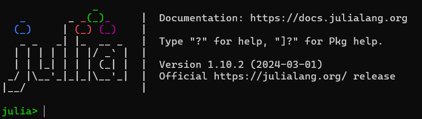
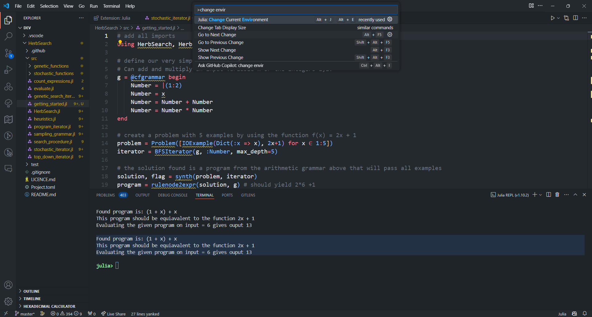

# Installation Guide

Before installing Herb.jl, ensure that you have a running Julia distribution installed (Julia version 1.7 and above were tested). Check below for a more detailed [Julia How-To](@ref).

Thanks to Julia's package management, installing Herb.jl is very straightforward. 
Activate the default Julia REPL using

```shell
julia
```

or from within one of your projects using

```shell
julia --project=.
```

From the Julia REPL run 
```julia
]
add Herb
```

or instead running

```julia
import Pkg
Pkg.add("Herb")
```

`which` will both install all dependencies automatically.

For later convenience we can also add the respective dependencies to our project, so that we do not have to write `Herb.HerbGrammar` every time.
```julia
] add HerbConstraints HerbCore HerbSpecification HerbInterpret HerbGrammar HerbSearch
```

And just like this you are done! Welcome to Herb.jl!

## Julia How-To

### 1. Install Julia

First, we need to install Julia before we proceed.
Head over the Julia downloads [page](https://julialang.org/downloads/) and follow the instructions.

#### Linux & MacOS

Have a look at the installation page for your distribution or simply paste this into a terminal. 
```sh
curl -fsSL https://install.julialang.org | sh
```

#### Windows

Put this command in Powershell.
```sh
winget install julia -s msstore
```

If `winget` is not installed install it by checking this link (https://phoenixnap.com/kb/install-winget)

#### Check Julia installation
Open a command prompt/terminal and run `julia`.

You should see something similar to this:



You will see the start-up message above, including the version number. At the time of writing, this is `1.10.2`. You will likely see the latest stable release, [listed on the Julia organization's website](https://julialang.org/downloads/#current_stable_release).

### Julia REPL
What you see right now on the screen is called the Julia REPL (**R**ead–**E**val–**P**rint **L**oop). This is similar to `ghci` from Haskell and similar to `node`'s REPL too.

Let's try some simple things. Only type the part after `julia>` without the comment (the part after `#`)
```julia
julia> x = 2 # creates a variable called x with value 2
2            # prints the results 
julia> print("hello","julia")
hellojulia
julia> for x in 1:10        # for loop in julia
           println(x)     
       end                  # notice how we have to specify end here..
1
2
3
4
5
6
7
8
9
10

```
Now that `julia` hopefully works, let's clone the repositories. To exit `julia` use `Ctrl+D` or simply type `exit()`.

Typing `?` opens a help menu for what the `REPL` can do.
```sh
help?> 
search:  ] [ = $ ; ( @ { " ) ? . } ⊽ ⊼ ⊻ ⊋ ⊊ ⊉ ⊈ ⊇ ⊆ ≥ ≤ ≢ ≡ ≠ ≉ ≈ ∪ ∩ ∜ ∛ √ ∘ ∌ ∋ ∉ ∈ ℯ π ÷ ~ | ^ \ > < : / - + * ' & % ! && if :: as

  Welcome to Julia 1.10.2. The full manual is available at

  https://docs.julialang.org

  as well as many great tutorials and learning resources:

  https://julialang.org/learning/

  For help on a specific function or macro, type `?` followed by its name, e.g. ?cos, or ?@time, and press enter. Type ; to enter shell
  mode, ] to enter package mode.

  To exit the interactive session, type CTRL-D (press the control key together with the d key), or type exit(). <- Useful in case you forget how to exit :)
```

### 2. Clone and install projects - for development

Usually, in Julia one would create a script file (something like `file.jl`) and write his code there. However, Herb consists of packages that other people can use. Think about `pip` packages or `npm` packages. 

Thus, the setup will be a bit different from what you see in other programming languages.

1. First navigate to the home folder of your operating system. On Linux, this is just `cd ~`. On Windows open `cmd` and type `cd %userprofile%` (This will navigate to `C:/Users/your_username`). Alternatively, if using `PowerShell` simply type `cd ~`.
2. type `cd .julia` to navigate the folder where Julia keeps the installation things
3. type `julia` to enter the JULIA REPL. From here we will be able to also install the repositories
4. type `]` to enter the _"Package Mode"_ of Julia. From here, we can install packages and tasks related to dependency management. After typing `]` the `REPL` should now look like this


Notice that the ${\color{blue}blue}$ color on the left. This indicates that we are in the _"Package Mode"_ shell where we do not write code but run commands to manage dependencies or install packages.

5. To see what can we do from here, `?` is again helpful. Try to read through the output just to get an idea of what options are available.
6. Type `dev HerbSearch` Since we want to clone a package for local development we will use the `dev` or `develop` command. This will clone the package from _Github_ and store the repository in the `~/.julia/dev` folder.
7. After a lot of packages are installed, you can run `st` (short for status) to see that `HerbSearch` was successfully installed.

The output should look similar to this:


8. Exit the terminal (Ctrl+D) and check that a new folder `dev` appeared using `ls` (Linux) or `dir` (Windows)
9. Navigate to that folder `cd dev`. This is the folder where the `HerbSearch` package was cloned and where we are going to _develop_ our code. If we need to modify the code from other published packages such as `HerbData` we would have to `dev` the package locally to change it (e.g. `dev HerbData`)

### 3. Setup IDE (VSCode)

Hopefully, everything has gone smoothly so far 😅. Let's set up our IDE to start coding.

Unfortunately, there is no nice JetBrains IDE for Julia like IntelliJ, PyCharm, etc. There is a VSCode extension that is actively developed that works quite well. However, it is sometimes unstable and might crash from time to time (especially if you are on Windows). 
[This](https://github.com/julia-vscode/julia-vscode) is the extension that we will use.

If you do not want to use VSCode and want to use vim 😉 check [this](https://github.com/JuliaEditorSupport/julia-vim) link.

#### 1. Open VsCode 

Assuming `vs-code` is installed on the system and that you have your terminal still open in the `~/.julia/dev` folder you can simply type
```
$ code . 
```
To open the folder in VSCode.

#### 2. Install Julia extension
Open the extension tab either by clicking or by using the keyboard shortcut (`Ctrl+Shift+X`) and search for `julia` and install the first extension.


#### 3. Run some example code 

Create a new file in folder `src` and give it a name (e.g., `getting_started.jl`) with `.jl` as the suffix.
Paste the following example code 

```jl
# add all imports
using HerbSearch, HerbSpecification, HerbInterpret, HerbGrammar

# define our very simple context-free grammar
# Can add and multiply an input variable x or the integers 1,2.
g = @cfgrammar begin
    Number = |(1:2)
    Number = x
    Number = Number + Number
    Number = Number * Number
end

# create a problem with 5 examples by using the function f(x) = 2x + 1
problem = Problem([IOExample(Dict(:x => x), 2x+1) for x ∈ 1:5])
iterator = BFSIterator(g, :Number, max_depth=5)

# the solution found is a program from the arithmetic grammar above that will pass all examples
solution, flag = synth(problem, iterator)
program = rulenode2expr(solution, g) # should yield 2*6 +1 

println("Found program is: ", program)
println("This program should be equiavalent to the function 2x + 1")

# here we can evaluate our program on with input x = 6
input = 6
output = execute_on_input(SymbolTable(g), program, Dict(:x => input)) 
```

To run either click on the _Run_ button in the top right side of the screen and choose `Julia: Execute Active file in REPL` or press `ALT+Enter`
This will create a window that will spawn the Julia REPL and evaluate the code.

This will *not* work because by default VSCode chooses the Julia _environment_ `1.10` to run the code (Think about python virtualenv).
We want to run the code in the environment of `HerbSearch`. To do that we need to tell VSCode to switch to the right environment.

Open the command palette by typing Ctrl+Shift+P and type `change environment`


Now `Pick a folder` -> `HerbSearch`

Try again to run the code and it should work now.