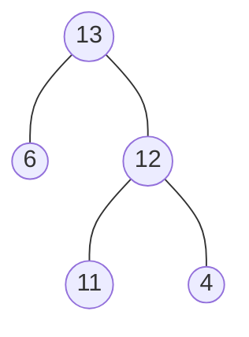
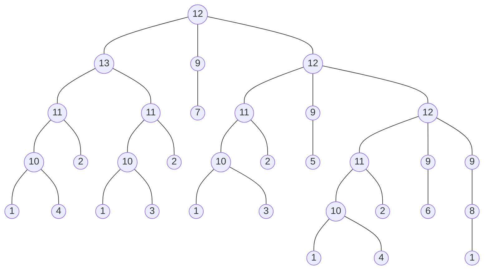

# Herb tutorial: Abstract syntax trees

In this tutorial, you will learn
    
- How to represent a computer program as an abstract syntax tree  in Herb.
- How to replace parts of the tree to modify the program.

## Abstract syntax trees

The syntactic structure of a computer program can be represented in a hierarchical tree structure, a so-called _Abstract Syntax Tree (AST)_. The syntax of a programming language is typically defined using a formal grammar, a set of rules on how valid programs can be constructed. ASTs are derived from the grammar, but are abstractions in the sense that they omit details such as parenthesis, semicolons, etc. and only retain what's necessary to capture the program structure. 

In the context of program synthesis, ASTs are often used to define the space of all possible programs which is searched to find one that satisfies the given specifications. During the search process, different ASTs, each corresponding to a different program, are generated and evaluated until a suitable one is found.

Each _node_ of the AST represents a construct in the program (e.g., a variable, an operator, a statement, or a function) and this construct corresponds to a rule in the formal grammar. 
An _edge_ describes the relationship between constructs, and the tree structure captures the nesting of constructs. 

## A simple example program

We first consider the simple program 5*(x+3). We will define a grammar that is sufficient to represent this program and use it to construct a AST for our program.

### Define the grammar


```julia
using HerbCore, HerbGrammar, HerbInterpret

grammar = @csgrammar begin
    Number = |(0:9)
    Number = x
    Number = Number + Number
    Number = Number * Number
end

```


    1: Number = 0
    2: Number = 1
    3: Number = 2
    4: Number = 3
    5: Number = 4
    6: Number = 5
    7: Number = 6
    8: Number = 7
    9: Number = 8
    10: Number = 9
    11: Number = x
    12: Number = Number + Number
    13: Number = Number * Number


### Construct the syntax tree

The AST of this program is shown in the diagram below. The number in each node refers to the index of the corresponding rule in our grammar. 



In `Herb.jl`, the `HerbCore.RuleNode` is used to represent both an individual node, but also entire ASTs or sub-trees. This is achieved by nesting instances of `RuleNode`. A `RuleNode` can be instantiated by providing the index of the grammar rule that the node represents and a vector of child nodes. 


```julia
syntaxtree = RuleNode(13, [RuleNode(6), RuleNode(12, [RuleNode(11), RuleNode(4)])])
```


    13{6,12{11,4}}


We can confirm that our AST is correct by displaying it in a more human-readable way, using `HerbGrammar.rulenode2expr` and by testing it on a few input examples using `HerbInterpret.execute_on_input`.


```julia
program = rulenode2expr(syntaxtree, grammar)
println(program)
```

    5 * (x + 3)


```julia
# test solution on inputs
output = execute_on_input(grammar, syntaxtree, Dict(:x => 10))
```


    65


## Another example: FizzBuzz

Let's look at a more interesting example. 
The program `fizbuzz()` is based on the popular _FizzBuzz_ problem. Given an integer number, the program simply returns a `String` of that number, but replace numbers divisible by 3 with `"Fizz"`, numbers divisible by 5 with `"Buzz"`, and number divisible by both 3 and 5 with `"FizzBuzz"`.


```julia
function fizzbuzz(x)
    if x % 5 == 0 && x % 3 == 0
        return "FizzBuzz"
    else
        if x % 3 == 0
            return  "Fizz"
        else
            if x % 5 == 0
                return "Buzz"
            else
                return string(x)
            end
        end
    end
end
```


    fizzbuzz (generic function with 1 method)


### Define the grammar

Let's define a grammar with all the rules that we need.


```julia
grammar_fizzbuzz = @csgrammar begin
    Int = input1
    Int = 0 | 3 | 5
    String = "Fizz" | "Buzz" | "FizzBuzz"
    String = string(Int)
    Return = String
    Int = Int % Int
    Bool = Int == Int
    Int = Bool ? Int : Int
    Bool = Bool && Bool
end
```


    1: Int = input1
    2: Int = 0
    3: Int = 3
    4: Int = 5
    5: String = Fizz
    6: String = Buzz
    7: String = FizzBuzz
    8: String = string(Int)
    9: Return = String
    10: Int = Int % Int
    11: Bool = Int == Int
    12: Int = if Bool
        Int
    else
        Int
    end
    13: Bool = Bool && Bool


### Construct the syntax tree

Given the grammar, the AST of `fizzbuzz()` looks like this:



As before, we use nest instanced of `RuleNode` to implement the AST.


```julia
fizzbuzz_syntaxtree = RuleNode(12, [
               RuleNode(13, [
                   RuleNode(11, [
                       RuleNode(10, [
                           RuleNode(1),
                           RuleNode(4)
                       ]),
                       RuleNode(2)
                   ]),
                   RuleNode(11, [
                       RuleNode(10, [
                           RuleNode(1),
                           RuleNode(3)
                       ]),
                       RuleNode(2)
                   ])
               ]),
               RuleNode(9, [
                   RuleNode(7)
               
               ]),
               RuleNode(12, [
                   RuleNode(11, [
                       RuleNode(10, [
                           RuleNode(1),
                           RuleNode(3),
                       ]),
                       RuleNode(2)
                   ]),
                   RuleNode(9, [
                       RuleNode(5)
                   ]),
                   RuleNode(12, [
                       RuleNode(11, [
                           RuleNode(10, [
                               RuleNode(1),
                               RuleNode(4)
                           ]),
                           RuleNode(2)
                       ]),
                       RuleNode(9, [
                           RuleNode(6)
                       ]),
                       RuleNode(9, [
                           RuleNode(8, [
                                RuleNode(1)
                            ])
                       ])
                   ])
               ]) 
    ])
```


    12{13{11{10{1,4}2}11{10{1,3}2}}9{7}12{11{10{1,3}2}9{5}12{11{10{1,4}2}9{6}9{8{1}}}}}


And we check our syntax tree is correct:


```julia
program = rulenode2expr(fizzbuzz_syntaxtree, grammar_fizzbuzz)
println(program)
```

    if input1 % 5 == 0 && input1 % 3 == 0
        "FizzBuzz"
    else
        if input1 % 3 == 0
            "Fizz"
        else
            if input1 % 5 == 0
                "Buzz"
            else
                string(input1)
            end
        end
    end


```julia
# test solution on inputs
input = [Dict(:input1 => 3), Dict(:input1 => 5), Dict(:input1 =>15), Dict(:input1 => 22)]
output = execute_on_input(grammar_fizzbuzz, fizzbuzz_syntaxtree, input)
```


    4-element Vector{Any}:
     "Fizz"
     "Buzz"
     "FizzBuzz"
     "22"


### Modify the AST/program

There are several ways to modify an AST and hence, a program. You can

- directly replace a node with `HerbCore.swap_node()`
- insert a rule node with `insert!`

Let's modify our example such that if the input number is divisible by 3, the program returns "Buzz" instead of "Fizz". 
We use `swap_node()` to replace the node of the AST that corresponds to rule 5 in the grammar (`String = Fizz`) with rule 6 (`String = Buzz`). To do so, `swap_node()` needs the tree that contains the node we want to modify, the new node we want to replace the node with, and the path to that node.

Note that `swap_node()` modifies the tree, hence we make a deep copy of it first.


```julia
modified_fizzbuzz_syntaxtree = deepcopy(fizzbuzz_syntaxtree)
newnode = RuleNode(6)
path = [3, 2, 1]
swap_node(modified_fizzbuzz_syntaxtree, newnode, path)
```


    6,


Let's confirm that we modified the AST, and hence the program, correctly:


```julia
program = rulenode2expr(modified_fizzbuzz_syntaxtree, grammar_fizzbuzz)
println(program)
```

    if input1 % 5 == 0 && input1 % 3 == 0
        "FizzBuzz"
    else
        if input1 % 3 == 0
            "Buzz"
        else
            if input1 % 5 == 0
                "Buzz"
            else
                string(input1)
            end
        end
    end


```julia
# test solution on same inputs as before
output = execute_on_input(grammar_fizzbuzz, modified_fizzbuzz_syntaxtree, input)
```


    4-element Vector{Any}:
     "Buzz"
     "Buzz"
     "FizzBuzz"
     "22"


An alternative way to modify the AST is by using `insert!()`. This requires to provide the location of the node that we want to as `NodeLoc`. `NodeLoc` points to a node in the tree and consists of the parent and the child index of the node.
Again, we make a deep copy of the original AST first.


```julia
modified_fizzbuzz_syntaxtree = deepcopy(fizzbuzz_syntaxtree)
# get the node we want to modify and instantiate a NodeLoc from it.
node = get_node_at_location(modified_fizzbuzz_syntaxtree, [3, 2, 1])
nodeloc = NodeLoc(node, 0)
# replace the node
insert!(node, nodeloc, newnode)
```


    6,


Again, we check that we modified the program as intended:


```julia
program = rulenode2expr(modified_fizzbuzz_syntaxtree, grammar_fizzbuzz)
println(program)
```

    if input1 % 5 == 0 && input1 % 3 == 0
        "FizzBuzz"
    else
        if input1 % 3 == 0
            "Buzz"
        else
            if input1 % 5 == 0
                "Buzz"
            else
                string(input1)
            end
        end
    end


```julia
# test on same inputs as before
output = execute_on_input(grammar_fizzbuzz, modified_fizzbuzz_syntaxtree, input)
```


    4-element Vector{Any}:
     "Buzz"
     "Buzz"
     "FizzBuzz"
     "22"

